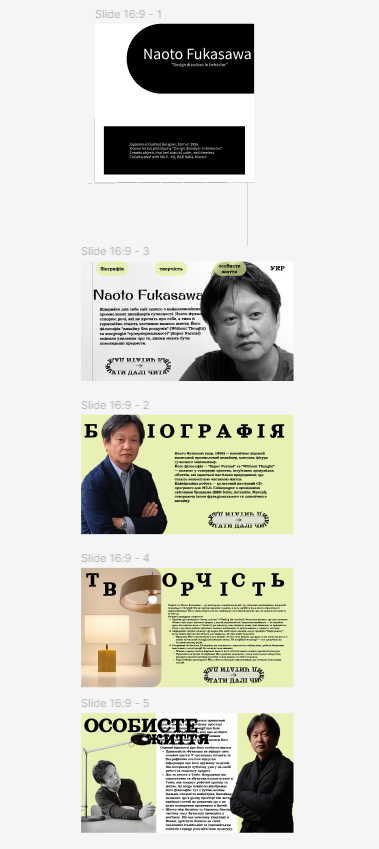
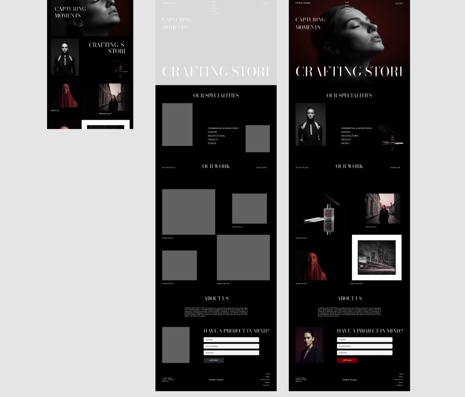

# 🎨 IT Design Portfolio

Hi! My name is Anastasiia.  
I am a 2nd-year IT Design student at Kyiv Aviation University, starting my journey in UI/UX and graphic design.

I am actively developing my skills and building my design portfolio.

---

## 👩‍💻 About Me
• IT Design student  
• Beginner UI/UX designer  
• Working in Photoshop & Figma  
• Open for internships and collaborations  

---

## 🛠 Skills
- Adobe Photoshop
- Figma
- UI/UX basics
- Infographics
- Visual composition
- Typography fundamentals

---

## 📂 Projects

### ### 🎯 Figma Project 1

UI design concept focused on layout and usability.

🔗 https://www.figma.com/design/cWPf5ZMBvC1x2lcNekWHjO/Untitled?node-id=0-1&t=t3mCr3R2Qn40bnHQ-1
---

### ### 🎯 Figma Project 2

Interface design concept demonstrating layout and visual balance.

🔗 https://www.figma.com/design/0QbHjtBkdv2xjewW9H1xta/Untitled

---

## 📁 Portfolio Files
Portfolio and infographic files are located in:

---

## 📬 Contact
Telegram:  
https://t.me/kiotobk

---

⭐ Thank you for visiting my portfolio!

